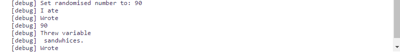
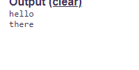
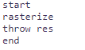
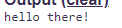

# Bundle
Bundle: A scratch-like, simple coding platform focused on community and friends!

## Commands

### debug
Will trigger debug console logs which includes info of each command ran and its arguments.
```
start
debug
write your code here...
```


### break
Will create a linebreak between 2 output logs
```
start
write hello
break
write there
end
```



### randomise
Will create a random number between 1 and 10, then it will set it to the variable called `random`.

You can also specify the maximum amount it should generate, such as:
```
randomise 100
```
Which will create a random number between 1 and 100

### rasterize
Will take the entire code and set it to a variable called `res`.


### write
Simply prints something to the console.
```
start
write hello there!
end
```



### ask
Asks the user for anything, then outputs the response to a variable called `res`.
```
start
ask How are you doing?
end
```

### def
Defines a variable.
```
start
def x=hello
def y=yo
end
```

**WARNING**: There must be no spaces between the variable name, the equal sign and the variable value unless you want them to have a space inside of them!

### throw
Will simply output a variable.
```
start
def x=hey
throw x
end
```

### if
Compares 2 items and blocks the next line of code if the statement is false
```
start
if x=y
write hello
write there
end
```
The code above will only write `there` since x is not equal to y
```
start
if x!=y
write hello
write there
end
```
The code above will write `hellothere` since x is not equal to y

### loop
Will loop the entire code untill the user stops it.